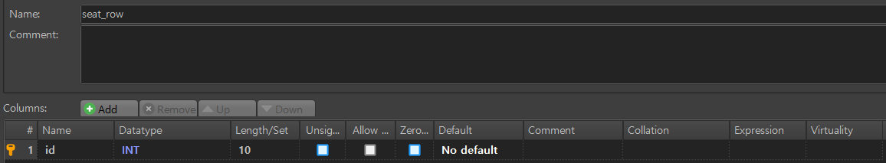
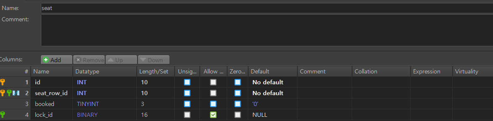
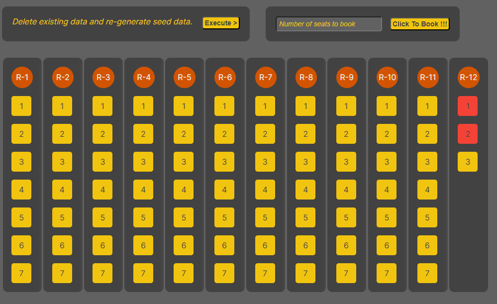

# A brief about the solution

The schema has been kept very simple. We have a table `schema_row` which relates to the rows in a coach. `seat` table relates to the seat in a seat row of a coach.

## SeatRow Schema



## Seat Schema



## sp_book

The main solution is packaged in procedure `sp_book`.

## SQL Code

It is present in `sql` folder.

### Basic Idea

-   Try to find if we have enough seat in a single row.
-   Start from the last seat as we have least number of seats there and thus in case if a user wants to book `1-3` seats it makes more sense to book seats there. Also, it would help to maximize the likelyhood of the number of bookings in which passengers can be seated together.
-   If we can't find a row with enough seats the result is ordered by `seat_row_id` in `DESC` order and `seat_id` in `ASC` order. Again, favoring to book the last rows first.
-   The procedure uses `select for update` to take a `lock` and then do the booking.

### What is missing?

-   Would have liked to create a `Mysql` based `Queue` and implement `distributed` transaction (that is the reason for creating `scheduler`).

## Config

-   Database : MySql v 8
-   Host: localhost
-   Port: 3306
-   Db_Name: trains
-   User: root
-   Password: root@123

> It can be changed in `.env.local`

## Running the app

The application has been tested only in `dev` environemnt and thus kindly use

```
npm run dev
```

or

```
npm start
```

package.json has been updated to use `next dev -p 8080` even while using `npm start`.

## Using the UI



-   Button Execute: It will delete whole data and re-genearte the data. This facilitates testing.
-   Button Click To Book: Just try to do the booking.
-   Color Code: `Yellow` represents `unbooked` seats and `red` represents `booked` seats.

## Video

[Video](https://drive.google.com/file/d/15DGbzz74jDFymqV9N436rCM7maowePCh/view?usp=sharing)
